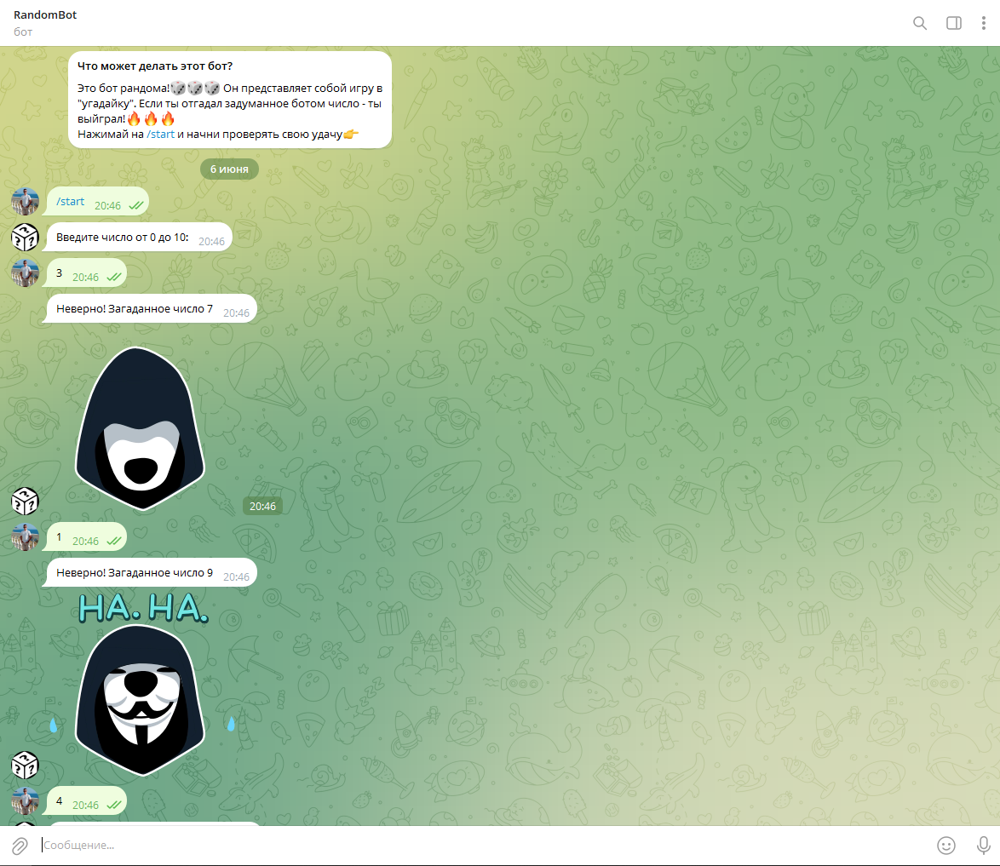
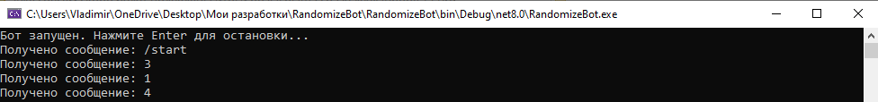
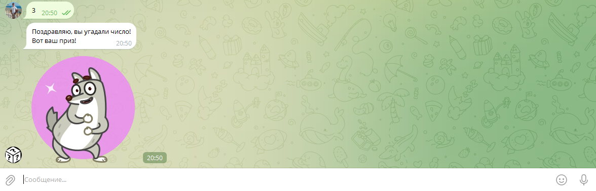

# RandomizeBot (Telegram Bot)

Телеграм бот для игры в *"угадайку"* случайных чисел с интерактивными стикерами. 

## Быстрый старт 🚀

### Предварительные требования ⚙️
- ОС: Windows 10/11
- Платформа: .NET 6.0+
- IDE: Visual Studio 2022
- Telegram: аккаунт в Telegram 
- Telegram Bot token

### Установка и запуск 🔧
1. Скачайте архив или клонируйте репозиторий(если установлен git)
   ```bash
   git clone https://github.com/BanCoder/RandomizeBot.git
   cd RandomizeBot
   ```
2. Настройте конфигурацию 
   
   Создайте файл `appsettings.json` *(в папке `bin\Debug` рядом с .exe)* и встевьте слудующее:
   ```json
    {
	    "TgSettings": 
        {
		    "token": "your token"
	    }
    }
   ```

>***Важно!*** Для того, чтобы получить необходимый токен, найдите в Telegram специального бота (например: [BotFather](https://t.me/BotFather)), он создаст необходимый токен и сгенерирует `"Что может этот бот?`. Также, вам необходимо придумать название для вашего будущего бота (должен заканчиваться на `bot`, например: `my_random_bot`)

3. Запустите программу в Visual Studio 2022
   - Откройте решение `RandomizeBot.sln`
   - Нажмите на `F5` или на кнопку `Пуск`
   - Перейдите в папку `bin\Debug` и запустите .exe файл
   
### Как использовать бота? 🕹️
- Найдите бота в Telegram по имени или перейти по ссылке(https://t.me/randombstbot)
- Запустите игру командой /start
- Введите число от 0 до 10
- Получите результат: 
    - Если угадали - получите "танцующий" стикер 
    - Если не угадали - получите "насмешливый" стикер

### Важно ⚠️
- Бот работает, **пока запущено консольное приложение**. Не закрывайте его!
- После запуска в консоли появится надпись: "Бот запущен..."

### Скриншоты 🖼️




### Особенности ✅
-  Случайная генерация - числа от 0 до 10
-  Интерактивные стикеры - визуальная обратная связь
-  Валидация ввода - проверка корректности данных
-  Мгновенная реакция - быстрое определение результата
### Архитектура 🛠️

#### Технологический стек 💻
- Консольное приложение (Майкрософт)
- Telegram.Bot - библиотека для работы с Telegram Bot API

#### Основные компоненты 📃
- RandomHandler - обработчик сообщений бота
- Randomizer - логика игры и генерации чисел

